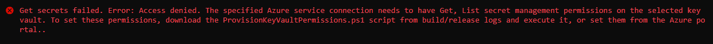

# Read secrets from Key Vault in a VSTS Release

[Home](../README.md) > [VSTS](./readme.md) > [Read from keyvault](./read-from-keyvault.md)

The goal is to create a Release Definition, and get secrets from Key Vault to inject values in a template ARM. For example, we need to get database password to initialize a new Azure SQL Database resource. Stock password in a Azure Key Vault is better than store it directly in `jsondeploy.parameters.json` or in `VSTS variables section`

Steps to follow :

* Create a new Release definition
* Create a Azure Key Vault task, and fill the needed values

If you try to create a new Release with this definition, an error will occur :


That's to say VSTS Agent must have the rights to read secrets from Key Vault. But by default, it's forbidden.

To give access to your VSTS agent, download the powershell script mentioned in error log (download all logs, the script will be included in .zip downloaded file). After that, add a new Azure Powershell task before the Azure Key Vault task.

In Azure Powershell task, select option `inline script` and paste script downloaded from previous log. The script is similar to :

```powershell
$ErrorActionPreference="Stop";
Login-AzureRmAccount -SubscriptionId 1aabb318-d016-4a43-abbd-53b09f24f98e;
$spn=(Get-AzureRmADServicePrincipal -SPN 8f010e7b-3197-4a12-a136-0f16c51db020);
$spnObjectId=$spn.Id;
Set-AzureRmKeyVaultAccessPolicy -VaultName kv20180724mb3 -ObjectId $spnObjectId -PermissionsToSecrets get,list;
```
